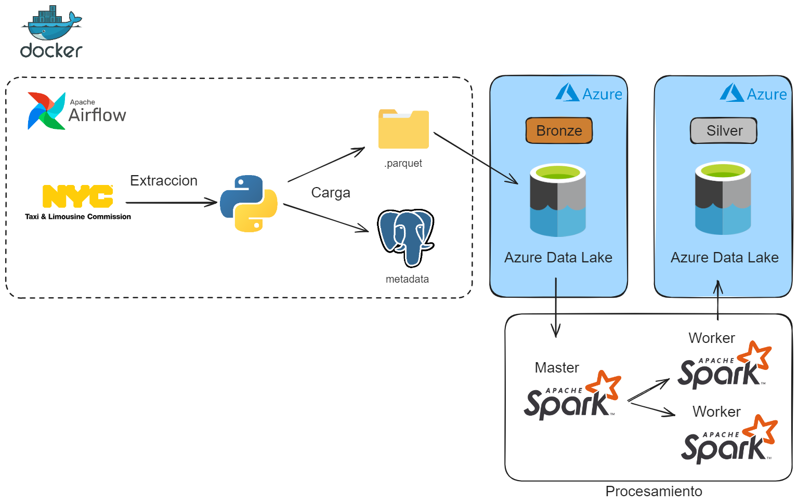

[](LICENSE)

# Taxis Amarillos Nueva York

Este proyecto trata de obtener datos de los taxis amarillos de Nueva York en formato Parquet, para almacenarlos en la capa Bronze de Azure Data Lake para su posterior tratado con Spark, y almacenado en la capa Silver del Azure Data Lake 

## Tabla de Contenidos
- [Funcionalidades Principales](#funcionalidades-principales)
- [Diagrama del proyecto](#diagrama-del-proyecto)
- [Instrucciones de Uso](#instrucciones-de-uso)
  - [Prerequisitos](#prerequisitos)
  - [Instalación](#instalación)
  - [Tests](#tests)
- [Tecnologías Utilizadas](#tecnologias-utilizadas)
- [Licencia](#licencia)
- [Contacto](#contacto)

## Funcionalidades Principales

- **Obtencion y almacenamiento de datos:** Permite obtener archivos Parquet de los datos de los taxis amarillos de Nueva York para posteriormente almacenarlos en la capa Bronze del Azure Data Lake. Orquestacion de este flujo mediante Apache Airflow. 

- **Procesamiento y nuevo almacenamiento de datos:** Permite procesar los datos de los archivos Parquet mediante Spark y almacenarlos particionados en la capa Silver del Azure Data Lake.

## Diagrama del proyecto



## Instrucciones de Uso

### Prerequisitos

1. Antes de comenzar, asegúrate de tener instalado Docker en tu máquina. Puedes descargarlo [aquí](https://www.docker.com/get-started).

2. Crea una cuenta o utiliza una existente de Microsoft Azure. Puedes crear la cuenta [aquí](https://azure.microsoft.com/en-us/free/open-source).

3. Una vez creada la cuenta de Azure, deberas crear una cuenta de almacenamiento. Esta cuenta de almacenamiento debe ser un ADLS Gen2 donde se almacenaran los datos de los taxis amarillos (archivos Parquet) en el Cloud.

4. Una vez tengas la cuenta de almacenamiento (ADLS Gen2) creada, deberas crear una aplicacion en el Azure Active Directory (AAD), crear un cliente secreto para la aplicacion y registrarla en el ADLS Gen2. Deberas darle los roles necesarios para poder interactuar entre Spark y la cuenta de almacenamiento.

5. Agrega las credenciales de la cuenta de almacenamiento para los DAGS en `dags/python/src/datalake/confconexiondatalake.py`

6. También agrega las credenciales de la aplicacion del AAD en `spark/configazure.py`

### Instalación

Para ejecutar la aplicación con Docker:

1. Clona este repositorio con el siguiente comando:

    ```bash
    git clone https://github.com/nachodorado98/Taxis-Spark-Azure.git
    ```

2. Navega al directorio del proyecto.

3. Ejecuta el siguiente comando para construir y levantar los contenedores:

    ```bash
    docker-compose up -d
    ```

4. **DAG DATA LAKE**

Inicia el DAG Data Lake en la interfaz de Apache Airflow para obtener los archivos Parquet y moverlos a la capa Bronze de Azure Data Lake: `http://localhost:8080`.

Este DAG obtiene, en base a los archivos ya obtenidos por fecha, los archivos Parquet con los datos de los taxis amarillos de Nueva York. Posteriormente los mueve a la capa Bronze del Azure Data Lake para almacenarlos como copia de seguridad. Esta planificado para ejecutarse de manera mensual pero se puede modificar e incluso ejeuctar de manera manual.

5. Dentro del contenedor del servicio `spark-master`, cambia al directorio del script para ejecutar la aplicacion de Spark:

    ```bash
    cd /opt/spark/nacho/scripts
    ```

6. Ejecuta el siguiente comando para ejecutar la aplicacion en streaming de Spark:

    ```bash
    spark-submit --packages "org.apache.hadoop:hadoop-azure:3.3.1,com.microsoft.azure:azure-storage:8.6.6" ./spark_script.py
    ```
Este script de Spark realiza una lectura de la informacion de los archivos Parquet almacenados dentro de la capa Bronze. Despues los procesa y escribe de manera particionada en la capa Silver. La escritura de datos se realizan en modo sobreescritura.

### Tests

Para ejecutar los tests de la obtencion de datos Parquet:

1. Asegúrate de que los contenedores estén en funcionamiento. Si aún no has iniciado los contenedores, utiliza el siguiente comando:

    ```bash
    docker-compose up -d
    ```

2. Dentro del contenedor del servicio `scheduler`, cambia al directorio de los tests:

    ```bash
    cd dags/python/tests
    ```

3. Ejecuta el siguiente comando para ejecutar los tests utilizando pytest:

    ```bash
    pytest
    ```

Este comando ejecutará todas las pruebas en el directorio `tests` y mostrará los resultados en la consola.

## Tecnologías Utilizadas

- [](https://www.python.org/)
- [](https://airflow.apache.org/)
- [](https://spark.apache.org/)
- [](https://azure.microsoft.com/en-us/free/open-source)
- [](https://www.postgresql.org/)
- [](https://www.docker.com/)


## Licencia

Este proyecto está bajo la licencia MIT. Para mas informacion ver `LICENSE.txt`.
## 🔗 Contacto
[](https://github.com/nachodorado98/Taxis-Spark-Azure.git)

[](mailto:natxo98@gmail.com)

[](https://www.linkedin.com/in/nacho-dorado-ruiz-339209237/)
